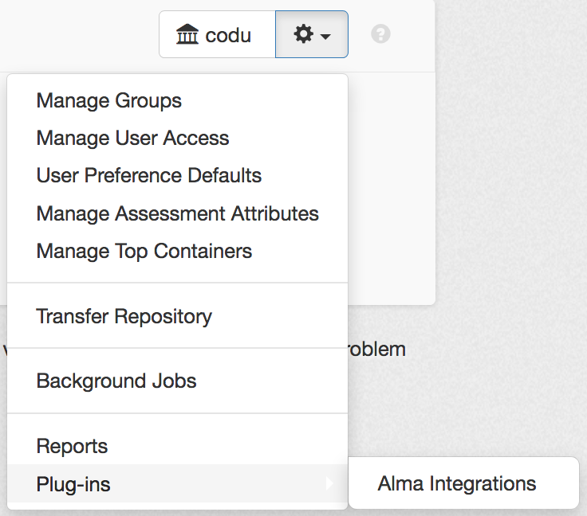
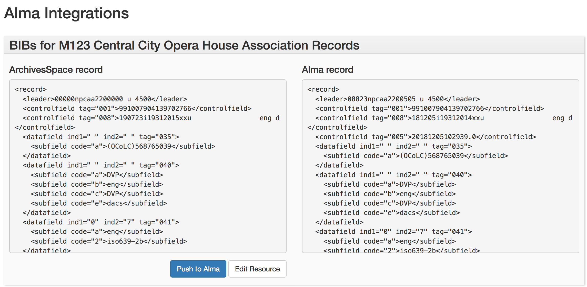
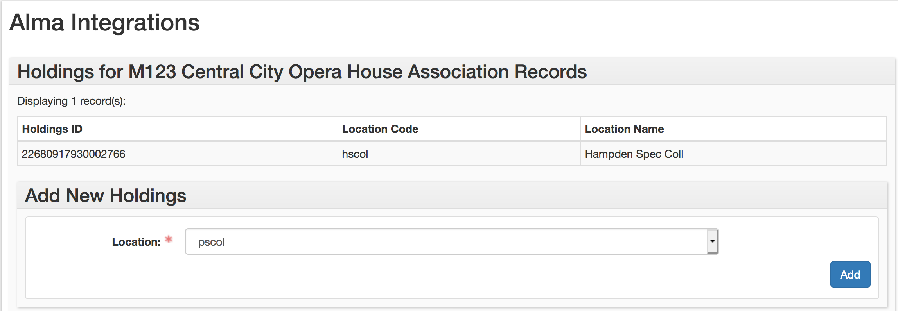
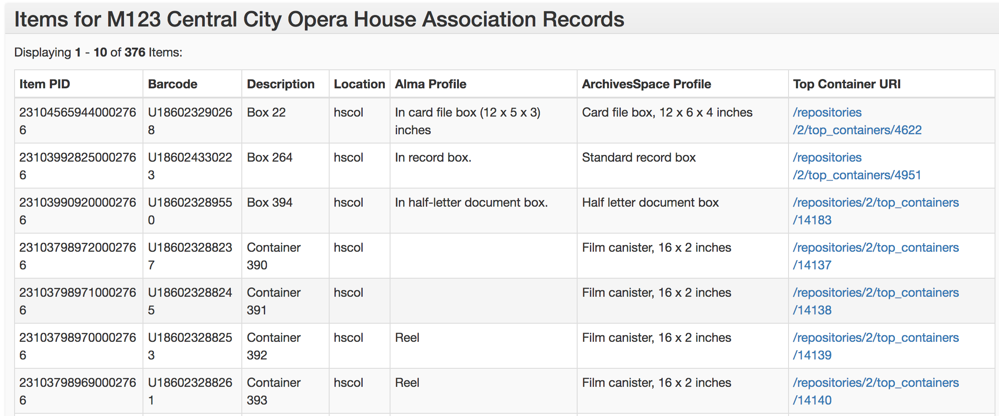

# Alma/ArchivesSpace Integrations

This plugin provides integrations between the ArchivesSpace archival collection management system and the Alma library management system from Ex Libris. It is built on the [Top Container](https://github.com/hudmol/container_management) functionality that Hudson Molonglo developed for ArchivesSpace. Based on the Resource record provided by a user, the integrations will perform the following API calls:

* Check for a BIB with the Resource's MMS ID
* Check for holdings associated with the BIB identified by that MMS ID

Additionally, the integrations allow a user to add new holdings, create a new BIB record if no MMS ID is present or the provided MMS ID does not match any BIB record in Alma, or sync changes to a Resource in ArchivesSpace with the BIB record uniquely identified by the Resource's MMS ID.

# Prerequisites

## For your Resource record

You will need to have a data element in your ArchivesSpace Resources assigned to the MMS IDs for their Alma bibliographic records, so that the API calls have an identifier against which to check. The University of Denver records MMS IDs in User Defined String 2; for now, this plugin assumes you also do this. Future development will allow this field to be configured on a per-instance basis.

## For your config.rb file

You will need to add three configuration settings to your config.rb file for these integrations to work:

* **AppConfig[:alma_api_url]** represents the URL you use to access the Alma API. These are region-specific; find yours [here](https://developers.exlibrisgroup.com/alma/apis#calling). Note that since the plugin only uses the `/bibs` API, you will need to include "/bibs" at the end of the API URL string.
* **AppConfig[:alma_apikey]** is the specific API key you use to access the Alma APIs. You may need to consult with your library IT department to access an API key to use for this plugin. If you would like to test API calls against the Alma sandbox, you may request a personal API key through the Alma Developer Network; instructions for this may be found [here](https://developers.exlibrisgroup.com/alma/apis#logging).
* **AppConfig[:alma_holdings]** is an array of the building and location codes in place at your institution. Each item in the array is itself an array, consisting of a building code (`852$b`) and a location code (`852$c`). These are added to the 852 field of the holdings records that the plugin creates.

# Using the integrations

The integrations may be accessed via the repository menu:

The plugin consists of a search form with two fields: the Resource, a linker where the user is prompted to search for a collection whose metadata in Alma they wish to view, and the Record Type, where the user is prompted to select the type of metadata with which they wish to work (either BIBs, Holdings, or Items). Once the resource and record type are selected, clicking the “Submit” button will initiate an Alma search.

Depending on the record type selected, the plugin will query the Alma API for either BIB, Holding, or Item metadata using the MMS ID provided in the linked Resource record. If no MMS ID is provided, an alert to that effect. will appear in the search results view.

## Resource BIBs

If the user selects BIBs as their record type, the plugin will display a side-by-side view of the MARC record generated by the ArchivesSpace API and the MARC record, if any, that is present in Alma with the MMS ID attached to the ArchivesSpace record. If there is no MMS ID present, the plugin will display a message to that effect in the Alma view.

If the user wishes to push changes from ArchivesSpace to Alma, e.g. if Resource-level metadata was added or updated in ArchivesSpace, clicking the “Push to Alma” button will overwrite the existing Alma MARC record with the MARC record generated by the ArchivesSpace API. If no MARC record is present in Alma for a Resource, clicking this button will create a new MARC record in Alma, then add that record’s MMS ID to the linked ArchivesSpace Resource. (Note that Alma's default is to suppress new records created via the API; for now you will need to use the Metadata Editor to un-suppress the record manually if you would like it published to Primo.)

Currently there is no way to pull changes made in Alma back into ArchivesSpace.

## Resource Holdings

If the user selects Holdings as their record type, the plugin searches for all holdings records attached to the BIB with the MMS ID provided by the user in the search form. It cross-checks the results against the list of location codes provided in the `alma_holdings_codes` setting of the ArchivesSpace instance's `config.rb` file, and returns a list of the holdings found via the API, including the record ID, location code, and location name for each.

To add new holdings, the user may select the desired holdings location from the drop-down list found in the Add New Holdings sub-record form. This list contains the location codes set in the `alma_holdings_codes` configuration setting which were not found in the holdings search. Upon selecting a location and clicking the “Add” button, ArchivesSpace will attempt to post the new holdings to Alma, then return to the plugin index page. If successful, the new Holdings ID will be returned; if not, the plugin will return the error message returned by the Alma API.

## Resource Items

Currently a search for the Item record type returns a list of items attached to the BIB record with the MMS ID found on the linked Resource record. The plugin displays fields that are used by Special Collections and Archives at DU for inventory control and container management. There is no way to synchronize item-level metadata between ArchivesSpace and Alma in any way at this time.

# Future Development

* Allow an ArchivesSpace instance to configure its own fields for MMS IDs
* See if it's possible to integrate Top Containers with Alma's circulation APIs??????????????????

# In Conclusion

Feel free to kick the tires on this against your own ArchivesSpace/Alma environment and let me know how it works. Questions, comments, and/or pull requests welcome! E-mail: kevin.clair [at] du.edu.
